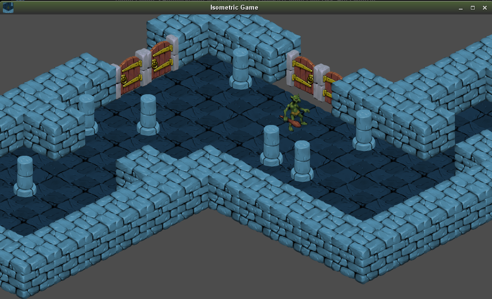
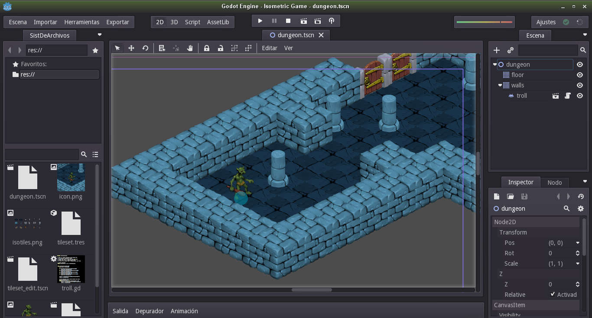
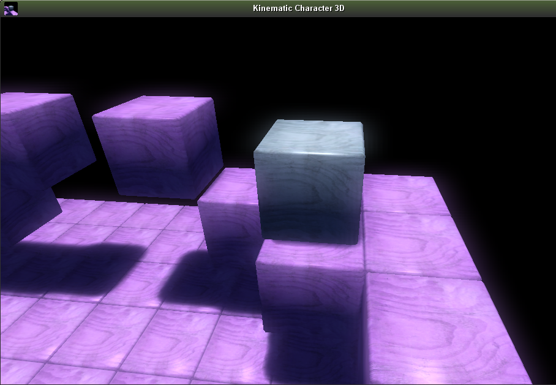

# Ejemplos de GodotEngine

Godot Engine viene con ejemplos que nos pueden servir de guía para aprender cómo hacer algunas cosas con el motor.

Los ejemplos los podemos descargar por la pestaña de `Templates` (Plantillas).

Veamos algunos ejemplos:
* Isometric Game `2d/isometric`*
* Kinematic Character 3D `3d/kinematic_char`

## Isometric Game (`2d/isometric`)

También podemos ver cómo están hechos, seleccionando un proyecto y luego editar.

Para terminar `Escena -> Salir`.

Si queremos quitar los proyectos de ejemplo de nuestra lista de proyectos, seleccionamos un proyecto y quitar. Esta acción no elimina el proyecto del disco duro, sólo lo quita de la lista de proyectos de la ventana administrador de proyectos.

Quito los dos ejemplos y dejo la lista de proyectos vacía.

## Kinematic Character 3D (`3d/kinematic_char`)

Podemos seguir importando el resto de ejemplos para ver qué cosas se pueden hacer con Godot Engine.
