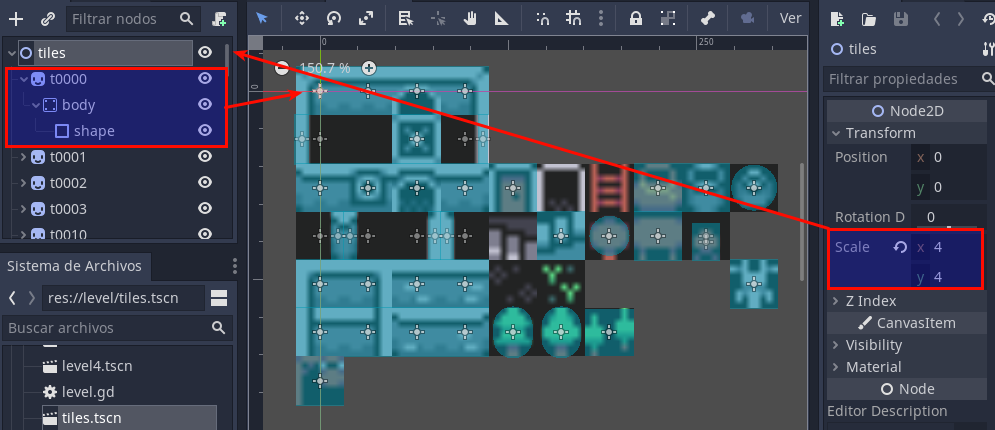

[<< back](README.md)

---
# Mapas

En la carpeta `assets/tiles`, veremos una serie de tiles (celdas) que corresponden con trozos de mapa de tamaño fijo. La idea es usar dichos tiles y unirlos para conseguir un mapa mayor. Si unimos los tiles de distinta forma conseguimos diferentes mapas.

## Escena con los tiles

Empezamos creando una nueva escena donde crearemos los tiles que vamos a usar.

> Aunque tengamos muchos `assets/tiles`, esto no quiere decir que los tengamos que usar todos.

* Crear nueva escena.
* Nodo raíz tipo **Node2D** y le ponemos el nombre `tiles`.
* Seleccionamos el nodo `tiles` y vamos a la ventana de propiedades.
* En el atributo `Node2D -> Transform -> Scale`, ponemos x=4 e y=4. Esto es para hacer un escalado por 4. Lo tenemos que hacer porque las imágenes (assets) que tenemos son de 8x8 y queremos hacer un juego con imágenes de 32x32.

**Crear la estructura de cada tile debajo del nodo raíz.**

Ahora vamos a incluir todos los tiles en la escena de la siguiente forma:
* Añadir un nodo hijo a la raíz de tipo **Sprite**. Le ponemos el nombre `t0000` para saber que se corresponde con el "tile_0000.png". Sólo es por comodidad.
* Seleccionamos el nodo `t0000` y vamos a la ventana inspector de propiedades.
* Buscamos la propiedad **texture** y cargamos la imagen asociada `assets/tiles/tile_0000.png`. Ahora debemos ver la imagen en pantalla.
* Debajo del nodo sprite `t0000` añadimos un nodo hijo de tipo **StaticBody2D** con el nombre `body`.
* Debajo del nodo `body` creamos un nodo hijo del tipo **CollisionShape2D** y lo llamamos `shape`.
* Seleccionamos el nodo `shape` y vamos a la ventana de propiedades. En el atributo **Shape** elegimos rectángulo y establecemos su tamaño para que se ajuste al sprite.

---
## Tileset

---
## Tilemap: creando los mapas

Scene map1:
* Escena que representa el primer nivel o mapa.
* Node2D con:
    * tilemap de (tiles)
    * actor/player

    ---
    # Level 1 mapa 1

    Scene tiles:
    * Crear una escena con todos los tiles del mapa.
    * Cada tile será: sprite -> body -> shape.
    Scene map1:
    * Escena que representa el primer nivel o mapa.
    * Node2D con:
        * tilemap de (tiles)
        * actor/player
