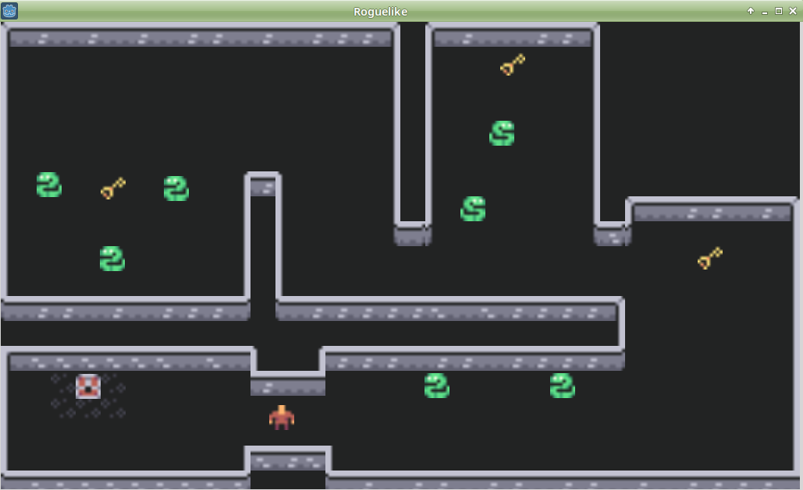

# Roguelike

Es es un proyecto para aprender a crear juegos 2D con GodotEngine.

Roguelike es un juego de mapas 2D, con laberintos donde tenemos que encontrar las llaves para poder abrir el cofre y escapar de la mazmorra.

Además debemos tener cuidado con serpientes, ratas, perros y todo tipo de animales que nos tratarán de impedir conseguir nuestro objetivo de escapar.

## Objetivos

Esto es lo que vamos a ver en esta demo:
* Instalar el software necesario y obtener los assets.
* Organizar nuestro proyecto.
* Usar escenas y nodos.
* Usar los Nodos: node2d, sprite, kinematicBody2D, staticBody2D, collisionShape, area2d.
* Programación con GDPython.
* El uso de las señales.

## Documentación

* [Preparativos](01-preparativos.md)
* [Mover](02-mover.md)
* [Mapa](03-mapa.md)
* [Enemigos](04-enemigos.md)
