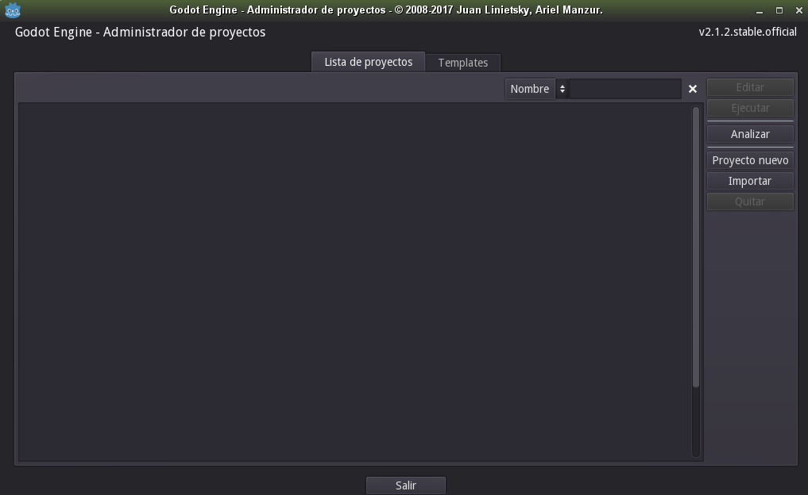

# Instalación de Godot

Nosotros vamos a usar el motor de videojuegos Godot Engine. El proceso de instalación es muy sencillo:
* Creo el directorio `learn-godot` para poner los ficheros dentro.
* Descargamos el programa (Standard Version) desde la página web de [GodotEngine](http://www.godotengine.org/download).
* Tendremos algo como:
```
learn-godot
└── Godot_v3.1.2-stable_x11.64.zip
```
* Descomprir el fichero zip, y ya estamos el programa Godot listo para usar.
> **OpenSUSE**: Si usas el sistema operativo OpenSUSE, puedes instalar Godot con `zypper install -y godot`, puesto que está disponible en sus repositorios.

* Comprobamos que funciona, ejecutando el programa y veremos lo siguiente (_La imagen corresponde con Godot versión 2.1.2_):



¡Funciona! Se nos abre la ventana que muestra el **administrador de proyectos**, con un listado (vacío por ahora) de los proyectos disponibles.

* Creamos el directorio `proy`. Lo usaremos para guardar los proyectos que vamos a ir creando. Los ficheros quedarán así:
```
learn-godot
├── Godot_v3.1.2-stable_x11.64
└── proy
```
