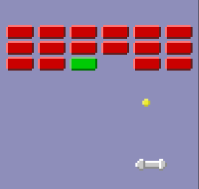
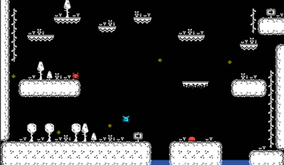
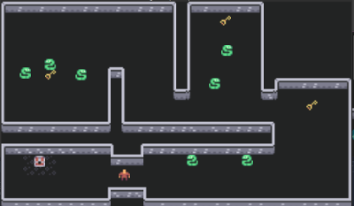
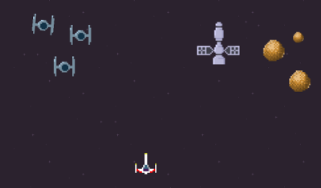
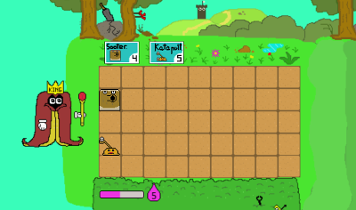

[<< back](../README.md)

# Godot game index

## [Arkanoid](../mini.demos/2d/arkanoid)

* 2d/arkanoid: Inspirado en los ejemplos y vídeos de Rafanoid.
* Se usa el motor de física en el movimiento de la pelota, aprovechando que todos los elementos del juego son cuerpos físicos: RigidBody2D(pelota), StaticBody2D(los muros), KinematicBody2D(player).
* Hay una ventana de menú inicial, y una ventana de pausa creadas con los elementos de GUI(Container, Label y Button).
* Futuro: añadir efecto de Particle2D a la pelota, aumentar el número de niveles, diseñar varios muros con diferentes comportamientos (Por ejemplo diferente resistencia).

## [Multiplayer 2](../mini.demos/net/multiplayer-2)

* net/multiplayer-2: Es una versión simplificada de la [demo Pong en red](https://github.com/godotengine/godot-demo-projects/tree/master/networking/multiplayer_pong). A partir de este juego se ha simplificado al máximo para dejar una estructura mínima que simplemente refleje la conexión entre dos programas (servidor y cliente) y cómo se sincronizan los cambios entre ellos.
* Para poder verlo en acción en necesario ejecutar el mismo programa 2 veces. En máquinas diferentes conectadas en red o en la misma máquina.
* El mismo programa se ejecuta dos veces (en dos máquinas diferentes o en la misma). Un ejecutable asume el rol de servidor (player1) y el otro el del cliente (player2). Tanto el código del servidor como el del cliente están ambos integrados en el mismo proyecto.

## Multiplayer (server-client)

* Este es un ejemplo muy simplificado de un programa que permite la conexión de un número variable de jugadores.
* El ejemplo está compuesto por dos proyectos separados: programa del servidor y
    * net/multiplayer-server: programa que ejecuta el servidor. Por defecto el servidor trabaja en el puerto 5000. Puede ser necesario abrir el cortafuegos.
    * net/multiplayer-client: programa que ejecuta cada uno de los clientes.
* El proyecto está basado en las ideas de [Godot dedicated server tutorial](https://mrminimal.gitlab.io/2018/07/26/godot-dedicated-server-tutorial.html)

## [Platform](../mini.demos/2d/platform)

* 2d/platform: Juego de plataformas con gráficos de 16x16 y 1bit color, descargados de la página web de Kenney.
* El player es un KinematicBody2D con colisiones con el entorno. Las plataformas móviles también son KinematicBody2D.
* Los enemigos son Area2D.
* Para diseñar el mundo se ha usado TileMap y TileSet para crear un conjunto de celdas (tiles).
* Los actores están animados usando AnimatedSprite.
* Futuro: De momento sólo tenemos un nivel, pero la idea es crear más pantallas formando un mapa más complejo.
Se pueden coger unos objetos brillantes, pero por ahora no sirven para nada.

## [Platform (Top-Down)](../mini.demos/2d/platform-top-down)

* 2d/platform-top-down: Es una demo que implementa la forma de juego plataformas pero con una vista top-down. Esto es, hay distintas alturas en el mapa del juego. Para subir se usan las escaleras o el salto. Para bajar se usan las escaleras, el salto o dejarse caer por el borde de un nivel.
* Para mover el Player se usan las teclas WASD y J para saltar.
* El player es un KinematicBody2D que inicialmente está en la capa 1 (altura 1). A medida que se sube se modifica el valor de la capa. Se usan las teclas WASD para mover el personaje.
* Tenemos un TileMap(`map`) sin colisiones para hacer visible el mapa del juego.
* Para representar cada altura del mapa, se usan varios nodos TileMap dentro de `heights`. Donde `h1` representa el mapa de colisiones de la altura 1, `h2` el mapa de colisiones de la altura 2, etc.
* La lógica de funcionamiento del `player` se ha creado usando máquinas de estados. Donde tenemos los siguientes estados: `state/move`, `states/die`, `states/fall` y `states/jump`.

## [Roguelike](../mini.demos/2d/roguelike)

* 2d/roguelike: Un juego 2D de vista top-down, donde el player debe coger todas las llaves que abren la puerta para escapar del laberinto mientras esquivamos a los enemigos. Esta demo jugable puede ser adecuada para empezar a aprender.
* Para mover el Player se usan las teclas WASD.
* Para diseñar el mundo se ha usado TileMap y TileSet para crear un conjunto de celdas (tiles).
* Se usa el motor de física para controlar la colisiones. El player es un KinematicBody2D y los muros del laberinto StaticBody2D.
* Los enemigos son Area2D para poder detectar las colisiones. Además cada enemigo tiene un comportamiento diferente que se puede configurar.
* Ir a [explicación](roguelike/README.md) para ver un pequeño resumen.
* Futuro: Crear ventanas de inicio y pausa.

## [Star-Shooter](../mini.demos/2d/star-shooter)

* 2d/star-shooter: Shooter de scroll vertical. Los assets son imágenes de 16x16, hechas con Gimp y luego escaladas a 48x48 para resaltar el efecto de pixelado. Los assets no son muy elaborados. Son de creación propia, usando Gimp para el pixel art.
* Todos los objetos del juego son del tipo Area2D. Actualmente están definidos los siguientes elementos: Rocas (pequeñas y grandes), Satélites, Tie-figther y el X-Wing(Player).
* Efectos: tenemos efectos de explosiones creados con Particle2D, además se usa Timer y SelfModulate para el efecto flash cuando se recibe un impacto no letal.
* Hay dos ficheros Singleton: Global y Loader. Global para las variables globales del juego. Loader para contener las funciones de construcción del nivel. El diseño del nivel se hace en un fichero de texto (level/level2.txt) que Loader lee y construye.

## [Tower Defense](../mini.demos/2d/tower-defense)

* 2d/tower-defense: EN CONSTRUCCION. Los assets son de Aarón VJ, creados con Gimp.
* De momento sólo permite escoger entre 2 tipos de cartas, y colocar las piezas en la primera columna del tablero.
* Futuro: En construcción!
