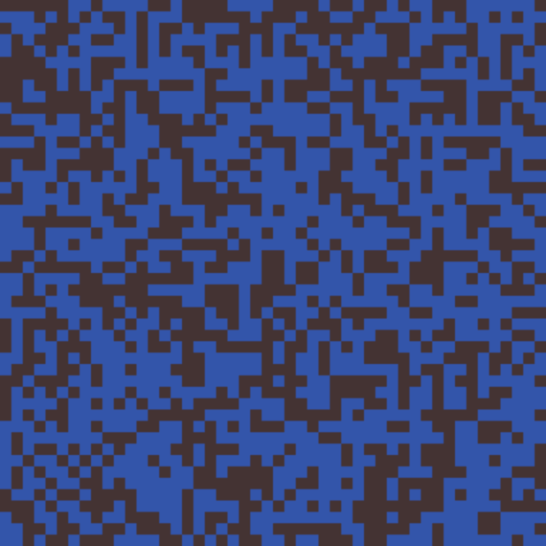
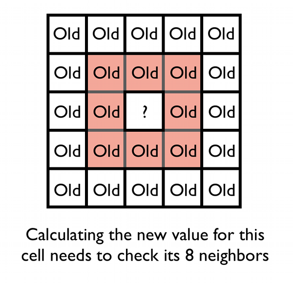

[<< back](../README.md)

# Generación de cuevas usando autómatas celulares

> Traducción al español del artículo "Generate Random Cave Levels Using Cellular Automata"(https://gamedevelopment.tutsplus.com/tutorials/generate-random-cave-levels-using-cellular-automata--gamedev-9664).

# 1. Introducción

Añadir algo de generación en tu juego es una buena forma de darle un valor añadido. A los jugadores les encanta porque obtienen contenidos nuevos, impredecibles y excitantes cada vez que juegan. En este tutorial vamos a ver cómo generar niveles aleatorios.

En este tutorial vamos a construir un generador de cuevas. Veamos un ejemplo:

Este generador nos devolverá una matriz bidimensional, donde cada posición indicará si hay un bloque o está vacío. De modo que podemos usar este generador para todo tipo de juegos: mazmorras, niveles para juegos de estrategia, tilemaps para juegos de plataformas, incluso como arena para shooter multijugador. Intercambiando las bloques y los espacios libres tenemos también un generador de islas.

# 2. El juego de la vida

¿En qué consisten los autómatas celulares?

En lo 70, el matemático John Conway publicó "The Game Of Life". No era un juego, sino una simulación que cogía una rejilla de células (que podían estar vivas o muertas) y luego le aplicaba unas simples reglas.

En cada paso de la simulación se aplicaban estas reglas cada celda:

* Si la célula tiene menos de dos vecinos vivos, se muere.
* Si la célula tiene 2 o 3 vecinos, permanece viva.
* Si la célula tiene más de 3 vecinos, se muere.
* Si la celda está vacía (célula muerta) y tiene exactamente 3 vecinos, entonces aparece una célula viva en esa posición.

Ahora si iniciamos la rejilla con valores aleatorios, obtendremos diferentes evoluciones de la simulación. "The Game of Life" es un ejemplo de un autómata celular. Esto es, una rejilla de celdas que se le aplican ciertas reglas.

# 3. Implementar un autómata celular

## 3.1 Crear la rejilla

Vamos a representar nuestra rejilla de células por un Array de dos dimensiones (**cellmap**), que contendrá valores Booleanos (true o false). Inicializaremos esta matriz con valores aleatorios en cada una de sus celdas.

Definiremos una variable **chanceToStartAlive**, que determinará la probabilidad de que una celda contenga una célula viva. Para nuestro ejemplo comenzaremos con un valor de 45%. Veamos ejemplo:

## 3.2 Aplicar reglas de cambio

En "The Game Of Life", cada vez que la simulación avanzaba un paso, en cada celda se comprueban las reglas de vida, para ver si hay que cambiar el estado vivo o muerto. Usaremos esas mismas ideas para construir nuestras cuevas, y escribiremos una función (**doSimulationStep**) que itere sobre cada celda de la rejilla y aplique unas reglas básicas para decidir si vive o muere.

Esta función **doSimulationStep**:

* Crea una nueva rejilla con los cambios de estado. Recordemos que a la hora de calcular el valor futuro de cada celda, hay consultar el valor actual de sus 8 vecinos.

* Contamos el número de vecinos para cada celda (**countAliveNeighbours**). Cuando estemos calculando en una celda de los límites de la rejilla (bordes del mapa), habrán algunos valores de vecinos que no tengamos. En estos casos asumimos un valor por defecto: vecino vivo o espacio vacío.

Para cada celda aplicaremos las siguientes reglas:
* Muertes: Si en la celda hay una célula viva y el número de vecinos es menor a **deathLimit**, entonces la célula muere.
* Nacimientos: Si en la celda no hay célula, y el número de vecinos es mayor que **birthLimit**, entonces se crea una célula nueva en esa posición.

Estas reglas son más sencillas que las del juego de la vida.

## 3.3 Afinando el proceso

La función anterior aplica nuestras reglas del autómata celular sobre la rejilla una sola vez. Si aplicamos estas reglas más veces (**numberOfSteps**) podremos ver que el mapa puede seguir evolucionando hasta que llega a un estado estable, donde ya no hay más cambios.

he only really new bit of code is a for loop that runs our simulation method a set number of times. Again, pop it in a variable so we can change it, because we're going to start playing with these values now!

Resumiendo, las variables que nos permiten parametrizar nuestro mapa son:

* **chanceToStartAlive**, establece cuánto de denso se creará nuestra rejilla inicial con células vivas.
* **deathLimit** es el número de vecinos, por debajo del cual la célula muere.
* **birthNumber** es el número de vecinos que causa el nacimiento de una nueva célula.
* **numberOfSteps**, es el número de veces que se aplican las reglas de transformación a la rejilla.

# 4. Extras

## 4.1 Relleno por inundación

El relleno por inundación es un método simple para encontrar los espacios dentro de la matriz que están conectados con un punto concreto.

Algunas veces el mapa tendrá será una gran cueva, pero en otras ocasiones tendremos varias cuevas más pequeñas separadas entre sí.
Pero también se podemos usar este método para averiguar cómo es de grande la cueva.

> Enlace de interés:
> * [Flood fill](https://en.wikipedia.org/wiki/Flood_fill)

## 4.2 Colocar el tesoro

Colocar el tesoro en una buena zona puede ser complejo. Nosotros como podemos calcular cuantos vecinos (paredes) tiene cada celda podemos usar esa información para buscar un sitio adecuado.

Si una celda de la rejilla está rodeada por muchas paredes puede ser el final de un pasillo o un hueco escondido en las paredes de la caverna. Éste puede ser un buen sitio para esconder el tesoro aunque no es perfecto. Algunas veces el tesoro podría estar inaccesible en huecos de las cuevas y otras el lugar será demasiado obvio.
