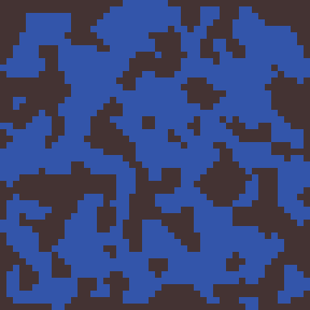

[<< back](procedural-content-md)

# Generación de cuevas usando autómatas celulares

> Traducción al español del artículo "Generate Random Cave Levels Using Cellular Automata"(https://gamedevelopment.tutsplus.com/tutorials/generate-random-cave-levels-using-cellular-automata--gamedev-9664).

# 1. Bienvenido a las cuevas

Añadir algo de generación en tu juego es una buena forma de darle un valor añadido. A los jugadores les encanta porque obtienen contenidos nuevos, impredecibles y excitantes cada vez que juegan. En este tutorial vamos a ver cómo generar niveles aleatorios.

En este tutorial vamos a construir un generador de cuevas. Veamos un ejemplo:

Este generador nos devolverá una matriz bidimensional, donde cada posición indicará si hay un bloque o está vacío. De modo que podemos usar este generador para todo tipo de juegos: mazmorras, niveles para juegos de estrategia, tilemaps para juegos de plataformas, incluso como arena para shooter multijugador. Intercambiando las bloques y los espacios libres tenemos también un generador de islas.

# 2. El juego de la vida

¿En qué consisten los autómatas celulares?

En lo 70, el matemático John Conway publicó "The Game Of Life". No era un juego, sino una simulación que cogía una rejilla de células (que podían estar vivas o muertas) y luego le aplicaba unas simples reglas.

En cada paso de la simulación se aplicaban estas reglas cada celda:

* Si la célula tiene menos de dos vecinos vivos, se muere.
* Si la célula tiene 2 o 3 vecinos, permanece viva.
* Si la célula tiene más de 3 vecinos, se muere.
* Si la celda está vacía (célula muerta) y tiene exactamente 3 vecinos, entonces aparece una célula viva en esa posición.

Ahora si iniciamos la rejilla con valores aleatorios, obtendremos diferentes evoluciones de la simulación. "The Game of Life" es un ejemplo de un autómata celular. Esto es, una rejilla de celdas que se le aplican ciertas reglas.

# 3. Implementar un autómata celular

Vamos a representar nuestra rejilla de células por un Array de dos dimensiones, que contendrá valores Booleanos (true o false).

We're going to start out by randomly setting each cell to either dead or alive. Each cell will have the same random chance of being made alive, and you should make sure that this chance value is set in a variable somewhere, because we'll definitely want to tweak it later and having it somewhere easy to access will help us with that. I'll use 45% to start off with.
