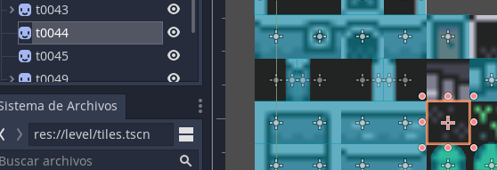
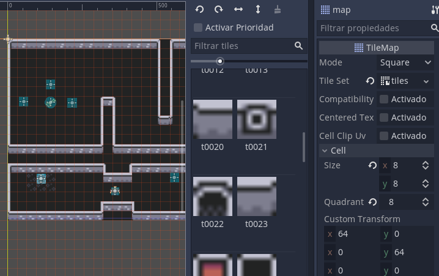

[<< back](README.md)

---
# Mapas

En la carpeta `assets/tiles`, veremos una serie de tiles (celdas) que corresponden con trozos de mapa de tamaño fijo. La idea es usar dichos tiles y unirlos para conseguir un mapa mayor. Si unimos los tiles de distinta forma conseguimos diferentes mapas.

## Escena con los tiles

Empezaremos creando una nueva escena donde vamos a seleccionar algunos tiles para nuestro futuro mapa.

> Aunque tengamos muchos `assets/tiles`, esto no quiere decir que los tengamos que usar todos.

* Crear nueva escena.
* Nodo raíz tipo **Node2D** y le ponemos el nombre `tiles`.
* Seleccionamos el nodo `tiles` y vamos a la ventana de propiedades.
* En el atributo `Node2D -> Transform -> Scale`, ponemos x=4 e y=4. Esto es para hacer un escalado por 4. Lo tenemos que hacer porque las imágenes (assets) que tenemos son de 8x8 y queremos hacer un juego con imágenes de 32x32.

## Añadir tiles uno a uno

Vamos a crear una estructura de nodos para cada tile debajo del nodo raíz, de la siguiente forma:
* Añadir un nodo hijo a la raíz de tipo **Sprite**. Le ponemos el nombre `t0000` para saber que se corresponde con el "tile_0000.png". Sólo es por comodidad.
* Seleccionamos el nodo `t0000` y vamos a la ventana inspector de propiedades.
* Buscamos la propiedad **texture** y cargamos la imagen asociada `assets/tiles/tile_0000.png`. Ahora debemos ver la imagen en pantalla.
* Debajo del nodo sprite `t0000` añadimos un nodo hijo de tipo **StaticBody2D** con el nombre `body`.
* Debajo del nodo `body` creamos un nodo hijo del tipo **CollisionShape2D** y lo llamamos `shape`.
* Seleccionamos el nodo `shape` y vamos a la ventana de propiedades. En el atributo **Shape** elegimos rectángulo y establecemos su tamaño para que se ajuste al sprite.

Repetimos el proceso anterior para cada uno de los tiles que necesitemos para nuestros futuros mapas. No hace falta seleccionarlos todos. Pero en mi caso incluí desde tile 0000 hasta tile 89. Coloqué los tiles uno al lado de otro y repartidos por varias filas. Este orden no tiene importancia. Ver imagen:

Algunos tiles como los muros, ventanas y puertas cerradas, tienen nodos StaticBody2D y CollisionShape2D para que el player no los pueda traspasar.

Otros tiles como suelos y hierbas sólo tienen nodo Sprite porque son visibles pero no deben colisionar con el player.

> **CONSEJO:** Este trabajo de crear los tiles es un poco repetitivo. Pero ten paciencia, luego lo agradecerás.

---
## Tileset

Cuando terminemos de añadir todos los tiles a la escena `tiles`, la grabamos como `res://level/tiles.tscn`.

Ahora necesitamos convertir esta escena en un objeto Tileset. Para ello hacemos `Menú -> Escena -> Convertir a... -> Tileset...` y la grabamos como `res://level/tileset.tres`.

El recuros `tileset.tres` que acabamos de crear, nos servirá para definir los mapas en nuestros niveles.

---
## Tilemap: creando los mapas

Volvemos a la escena `level/level1.tscn` que por ahora sólo tiene un nodo raíz y el player como nodo hijo.

* Seleccionar el nodo raíz.
* Añadir nodo hijo de tipo **TileMap** y lo renombramos como `map`.
* Seleccionamos el nodo `map` y en la ventana de propiedades vamos a:
    * Atributo "Tile Set -> Cargar -> level/tileset.tres".
    * Atributo "Size X = 8" y "Size Y = 8".

Ahora cada vez que seleccionamos el nodo `map` se nos muestra una paleta con los tiles que podemos arrastrar y colocar en la posición del mapa que queramos. De esta forma vamos confeccionando nuestro propio mapa de la escena.

* Al terminar, colocamos el nodo `player` en la posición inicial.
* Al pulsar `F5` veremos como nuestro player se mueve por el mapa y colisiona con las paredes.

Es divertido, pero necesitamos enemigos. Sigamos.

[next](04-enemigos.md)
