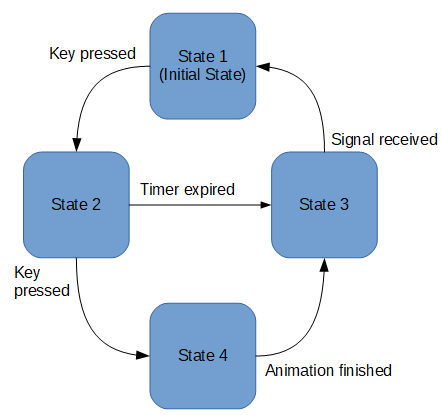

[<< back](../README.md)

# Máquina de estados

> Traducción al español del artículo "Godot State Machine" (https://gdscript.com/godot-state-machine)

En este tutorial exploraremos cómo controlar el estado de tu juego para que no se salga fuera de control.
La "Máquina de Estados Finitos" (FSM) es una excelente forma manera para lograrlo.

En cualquier punto de nuestro juego, los objetos del juego estarán en un estado concreto como: Waiting, Jumping, y Running.  
Cuando ocurra algún evento o se pulse una determinada tecla será cuando se podrá cambiar a otro estado.

Podríamos organizar nuestro juego con un diagrama de estados (Nodos), representando con flechas las transiciones entre estados. En cada transición indicaremos el evento que la dispara.

Veamos un ejemplo:



Por lado tendremos un nodo por cada estado, y cada nodo estado tendrá un script (código) asociado con:
* una función de entrada (`enter`),
* una función de salida (`exit`), y
* una función con la lógica interna (`update`) que envíe eventos y ejecute el código del Game Loop.

Para controlar la máquina de estados, tendremos un nodo raíz que contendrá a todos los nodos estado. Nosotros usaremos el siguiente ejemplo:

```
player
├── shape
├── sprite
└── states
    ├── attack
    ├── jump
    └── move
```

Donde `player` (KinematicBody2D) será el nodo raíz que actuará como el controlador de la máquina de estados, y los nodos `states/*`, serán todos los posibles estados.

Tanto el nodo `player` como `states/*`, tendrán asociado un fichero con código GDScript.

## Implementación del Controlador

El script `player.gd` tendrá el código necesario para controlar la máquina de estados: funciones para cambiar el estado, responder a los eventos, y volver al estado anterior.

```
extends KinematicBody2D

const DEBUG = true
var state = null
var history = []

func _ready():
	# Set the initial state
	state = get_node("states/move")
	_enter_state()

# Finity State Machine
func change_to(new_state):
	history.append(state.name)
	state = get_node("states/"+new_state)
	_enter_state()

func back():
	if history.size() > 0:
		state = get_parent().get_node(history.pop_back())
		_enter_state()

func _enter_state():
	if DEBUG:
		print("Entering state: ", state.name)
	# Give the new state a reference to this state machine script
	state.enter(self)

# Route Game Loop function calls to
# current state handler method if it exists
#func _process(delta):
#	if state.has_method("process"):
#		state.process(delta)

func _physics_process(delta):
	var new_state = null
	if state.has_method("update"):
		new_state = state.update(delta)

#func _input(event):
#	if state.has_method("input"):
#		state.input(event)

#func _unhandled_input(event):
#	if state.has_method("unhandled_input"):
#		state.unhandled_input(event)

#func _unhandled_key_input(event):
#	if state.has_method("unhandled_key_input"):
#		state.unhandled_key_input(event)

#func _notification(what):
#	if state && state.has_method("notification"):
#		state.notification(what)

```

* Cuando la constante `DEBUG` está activa, se muestran mensajes de diagnóstico en la ventana de salida.
* La variable `state` guarda la referencia al nodo de estado actual.
* La variabla `history`, guarda un histórico de todos los cambios de estado que se vayan produciendo.
* En la función `_ready` se define el estado inicial a "move".
* La función `change_to` realiza el cambio a un estado nuevo.
* La funcion `_enter_state` ejecuta el proceso de entrar en el estado (`enter`).
* La función `back` cambia al estado anterior del historial.

Cuando el juego está en ejecución hay métodos que se invocan en el controlador pero su implementación estará en los nodos estado (Por ejemplo `_process`, `_physics_process`, etc). En nuestro ejemplo podemos ver que cuando se invoca la llamada a la función `_physics_process(delta)` del controlador, se ejecuta el código del nodo estado `state.update(delta)`.

## Implementación de los Estados

Cada estado está representado por un nodo (`states/*`) y cada uno tiene asociado un script GDScript que almacenará el código que implementa la lógica asociada a dicho estado.

* La función `enter` ejecuta la inicialización para ese estado.
* La función `exit` llamará el mátodo `change_to(next_state)` del controlador.
* Lo que un estado hace cuando es el estdo actual dependerá de su lógica interna (`update(delta)`).

Veamos una plantilla de ejemplo:

```
extends Node

var host = null

func enter(_host):
	host = _host

func exit(next_state):
	host.change_to(next_state)

# Optional handler functions for game loop events
func update(delta):
  pass
```

El código anterior se puede copiar y personalizar para cada nuevo estado.

## Máquinas de estados concurrentes

En tus juegos, necesitar saber que el estado de otra Máquina de Estados Finitos(FSM) es donde el conexto es importante para la toma de decisiones.

Para esto, puedes tener una variable global (singleton) de tipo diccionario con, referencias a las distintas FSM y al estado actual de cada una.
