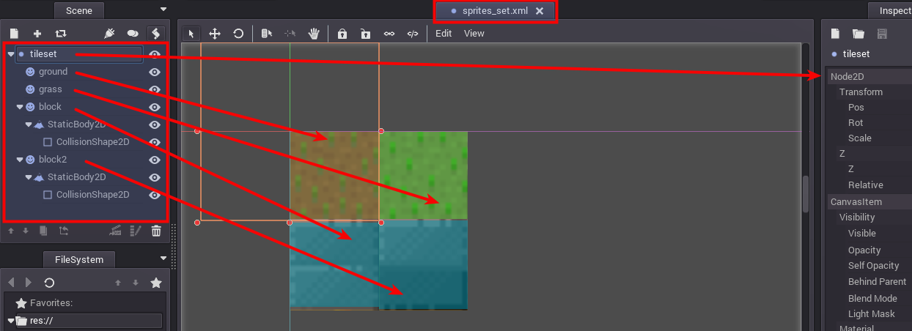
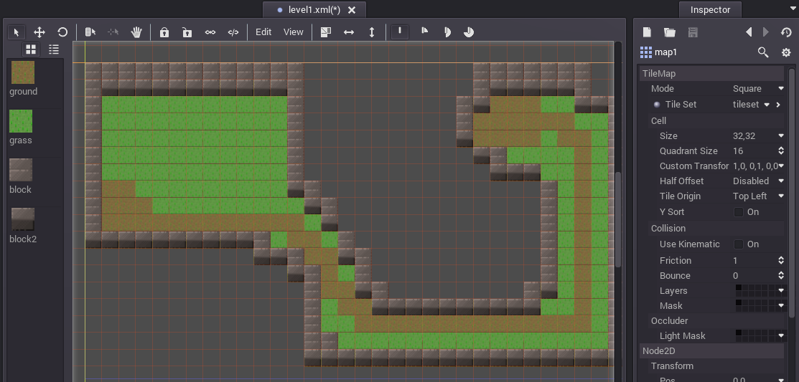

#Juego de Tilesmap

Vamos a crear una versión didáctica de un juego con un mapa de celdas 2D.

Créditos:

* Inspirado en [dynadungeos](https://github.com/akien-mga/dynadungeons)
* [CREDITOS](./CREDITS.txt)
* Otros proyectos parecidos:
    * [Pokemon Clone](https://github.com/MarianoGnu/Pokemon-Tutorials)
    * [TD-Godot-Games](https://github.com/TutorialDoctor/TD-Godot-Games)
* Vídeo [How to make a TileMap](https://www.youtube.com/watch?v=WwfIlut7X5I)

Esquema de trabajo:

1. Idea
2. Assets
3. Crear escenas: mundo, personajes, objetos
4. Lo unimos todo
5. Repetimos

#1. Idea

* La idea es empezar creando un simple mapa de tiles 2D, con un jugador que
se mueva por el mapa e interactúe con algún objeto. Elementos:
    * Mapa/tiles (Suelos, paredes, hierba, etc.)
    * Player
    * Objeto (Por ejemplo una caja o un tesoro)
* Creamos una carpeta `02-tilesmap` y dentro creamos un nuevo proyecto Godot.

#2. Assets

* Vamos a usar los diseños (Imágenes) del proyecto [dynadungeos](https://github.com/akien-mga/dynadungeons)
	* Fichero `sprites\tileset.png`
	* Ficheros `sprites\human-orange\*.png`
	* Ficheros `sprites\goblin-brown\*.png`
* Los copiamos en un directorio `sprites` dentro de nuestro proyecto Godot.
    * `02-tilesmap\sprites`

> La parte de crear nuestros propios diseños no se va a tratar en este tutorial.

#3. Crear escenas sueltas

Crearemos escenas sueltas para los personajes y objetos.

* Empezamos creando el mundo
* luego nuestro player
* y finalmente creamos la caja del tesoro

##3.1 El mundo

El mundo será un mapa de tiles 2D. Lo creamos en 3 pasos:
1. Creamos un conjunto de celdas (tiles) usando los sprites.
2. Convertimos el conjunto de celdas en un `Tileset`
3. Creamos un mapa con el `Tileset`

**Conjunto de sprites**

* GodotEngine -> Editamos proyecto
* Creamos nueva escena `sprites\sprites_set.xml` (Nodo2D)
* Creamos nodo hijo `ground` del tipo `Sprite`.
    * Textura -> load image `sprites/tileset.png`
    * Region = on
    * Seleccionar región 0,0,32,32
* Hacemos lo mismo con `grass`, `block` y `block` cambiando los valores XY de la región.

* `block` y `block2` van a ser celdas que provocarán colisiones con el player, por eso
les añadimos dos subnodos hijo:
    * `StaticBody2D`: Este nodo porta propiedades físicas a los bloques. 
    * `Collision Shape2D`: Este nodo aporta/define la forma/superficie de collisión.

> Cuando guardamos las escenas elegimos el formato XML.
> Usamos XML porque estamos usando GitHub para guardar el proyecto, 
y cuando los ficheros tienen texto plano la herramienta de control de 
versiones Git hace mejor su trabajo.

**Creamos el objeto Tileset**

* Convert to -> TilesMap -> Nombre `res://level/tileset1.xml`

**Creamos el mapa**
* Creamos nueva escena `level/map1.xml` 
* Nodo raíz `level1`de tipo `Node2D`.
* Nodo hijo `map1` de tipo `TileMap`.
    * Cargamos el tileset que ya teníamos en este mapa
    * TileMap -> Atributo TileSet -> Load = Fichero `level/tileset1.xml`
    * Cell -> Size = 32,32
    * Creamos el mapa

* Grabamos la escena (`CTRL+S`)

##3.2 El jugador

* Creamos una nueva escena `player/player.xml`, con nodo raíz de tipo `RigidBody2D`
    * Queremos que este objeto esté regulado por el motor de física.
* Creamos subnodos hijos:
    * `sprite` nodo de tipo `Sprite`
        * Atributo texture = imagen `sprites/human-orange/idle-down.png`
    * `shape` nodo de tipo `CollisionShape2D`

Vamos a programar un comportamiento del player para que responda a las
acciones del teclado/joystick.

* Vamos a `Project Settings -> InputMap` y añadimos las acciones: `player_left`,
`player_right`, `player_up` y `player_down`.
* Volvemos a la escena `player` y creamos un script `player/player.gd`.
     * Consultar script [player.gd](../../games/02-tilesmap/player/player.gd)

> Vemos que el código es muy sencillo, simplemente lee las acciones de entrada
y responde aplicando un cambio de posición al personaje `player`.

##3.3 La caja

El tesoro lo creamos de forma muy parecida al `player`.
* Nodo raíz `RigidBody2D`
* Nodo hijo `sprite` poniendo atributo textura con la imagen del tesoro.
* Nodo hijo `shape` del tipo `CollisionShape2D`.
* La escena se graba con `level/box.xml`.

> La diferencia con respecto a player, es que este objeto de momento 
no tendrá script asociado, para definir comportamiento.

#4. Lo unimos todo

Crearemos una escena para unir todos los elementos anteriores en forma
de una partida y/o nivel.

* Creamos nueva escena `level/level1.xml`.
* Añadimos:
    * 1 instancia de `player/player.xml`.
    * 1 instancia de `level/map1.xml`.
* Añadimos nodo hijo `cajas` de tipo `Node2D`.
    * Añadimos instancias del tipo `box/box.xml`
