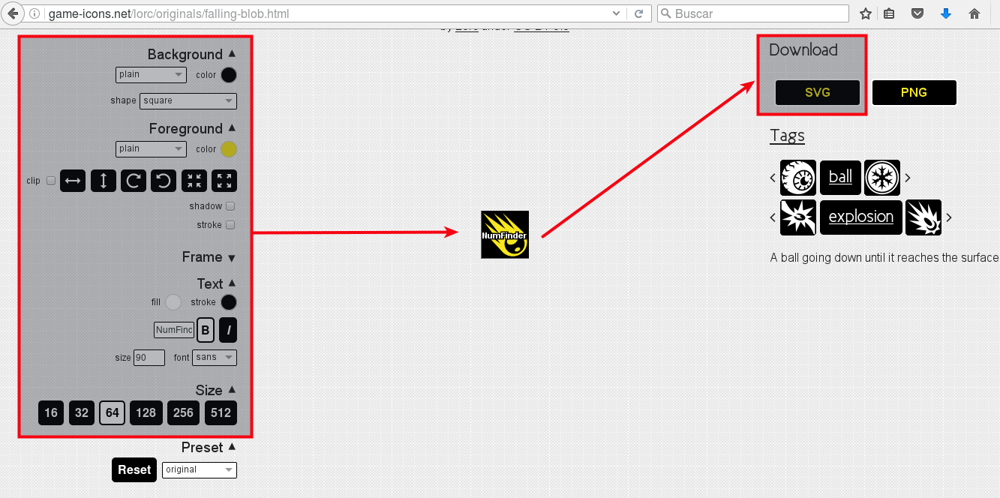

# Nuevo proyecto

Bueno vamos a empezar nuestro nuevo proyecto. Empezamos a trabajar ya, y me iré
parando a explicar cuando vaya surgiendo la necesidad.

Primero vamos a empezar con una idea para el proyecto. Se supone que de eso se
encargaría el diseñador de videojuegos, pero en nuestro caso lo decidimos nosotros.
Para empezar vamos a elegir algo sencillo de programar y con gráficos sencillos
para poder crearlos nosotros mismos. Es importante también elegir algo que nos guste.

Para este tutorial voy a hacer una versión del juego retro Asteorids. Los gráficos
los haré en dos colores y de forma muy básica.

Creo la siguiente estructura de directorios:
```
game/
├── assets
├── asteroids
├── levels
├── menu
└── ship
```

Imagino que voy a necesitar estas carpetas para los distintos elementos de mi juego:
Menú para el menú inicial del juego, la nave (ship), los asteroides (asteroids),
los assest (gráficos, sonidos, música, letra) y los distintos niveles de la partida (levels).

Es más fácil crear la estructura de directorios usando el explorador de archivos
propio del sistema operativo. Si al comenzar el proyecto cambiamos de opinión, siempre
podremos volver a crear una estructura nueva sin estropearlo todo.

Ahora sólo tenemos una estructura de directorios vacía. Vamos a crear el proyecto
Godot. Iniciamos Godot, se nos abre el administrador de proyectos -> Proyecto Nuevo.
En examinar localizamos la ruta de nuestro proyecto (Directorio `game`).
En nombre de proyecto voy a escribir `NumFinder version 1` (Pretendo ir modificando
el proyecto de forma gradual y en cada paso hacer un cambio en la numeración de la versión)
Y crear. ¡Listo! Ya tenemos nuestro proyecto... vacío.

```
game/
├── assets
├── asteroids
├── engine.cfg
├── icon.png
├── icon.png.flags
├── levels
├── menu
└── ship
```  
Se han creado 3 ficheros dentro de nuestra estructura de directorios.
* engine.cfg: es el fichero de configuración de nuestro proyecto Godot.
* icon.png: icono asociado al proyecto.
* icon.png.flags: configuración asociada al icono.

## Cambiar el icono

El icono de nuestro proyecto es uno por defecto.


Vamos a personalizarlo. Para
ello vamos a descargarno uno de la página [www.game-icons.net](www.game-icons.net),
donde podemos encontrar, personalizar y descargar iconos de forma libre CC-BY 3.0.

Buscamos un icono que podamos asociar a nuestro juego retro Asteoroids y lo personalizamos a nuestro gusto y con tamaño 64x64.
Lo descargamos en formato PNG.



Sustituimos el fichero icon.png del proyecto, por este nuevo icono.


Hemos cambiado el icono de nuestro juego.
¡Hasta aquí, bien! Pero vamos a empezar a crear algo dentro de nuestro juego.

Ir a [crear primera escena](02-first-scene.md)
