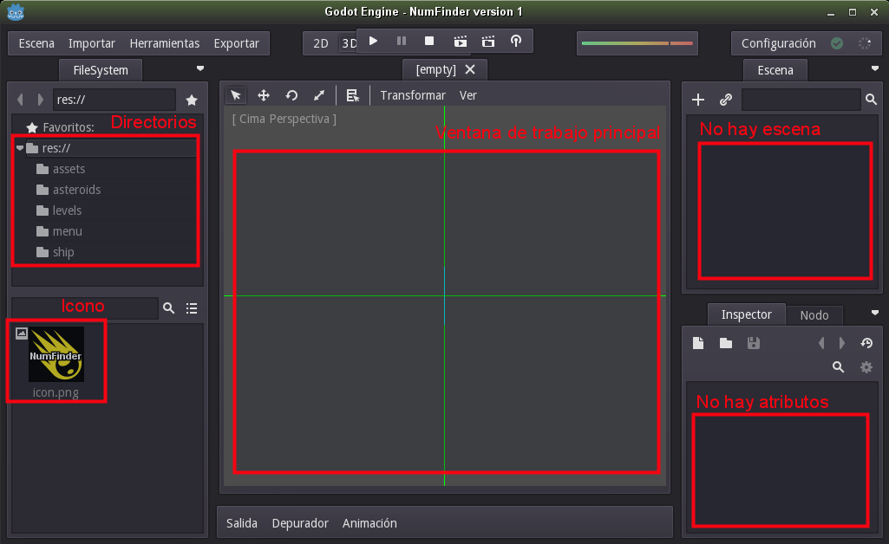

# Crear la primera Escena

Si iniciamos Godot, en el administrador de proyectos nos aparece nuestro nuevo proyecto "NumFinder". Veremos que el botón de ejecutar está deshabilitado porque todavía no tenemos nada que ejecutar. Así que vamos a editar el proyecto.

La ventana de edición de Godot es donde vamos a trabajar desarrollando nuestro proyecto. Así que vamos a explicar esta ventana.

En la izquierda tenemos la sección `FileSystem`, donde se muestran las carpetas y ficheros de nuestro proyecto.

En la zona central tenemos la ventana principal. Esta ventana puede estar en modo 2D, 3D o Scripting. Por defecto se pone en modo 3D y no muestra nada. Si queremos cambiar el modo lo hacemos en el menú superior.

En la zona derecha nos muestra las escenas, los nodos y sus propiedades. No tenemos ninguna.
Pero ¿qué son las escenas y lo nodos? ¿Y para qué sirven? Vamos a ver...

## Las escenas

Aquí les dejo un enlace a un [Tutorial sobre escenas y nodos](http://godot-doc-en-espanol.readthedocs.io/es/latest/tutorials/step_by_step/scenes_and_nodes.html) de Godot Engine muy bien explicado. Pero si tuviera que hacer un resumen yo diría que nuestro juego se va a construir uniendo escenas. Entonces nosotros nos vamos a centrar en diseñar y crear escenas, luego las uniremos y así conseguimos en juego.

¿Cuántas escenas tiene que tener un juego? Lo mínimo es una escena. Podríamos tener en una escena todo el juego pero... a medida que el proyecto crezca, será más cómodo dividirlo en varias escenas y trabajar cada una por separado.

En nuestro caso vamos a dividir el proyecto en las siguientes escenas:
* El menú principal del juego (menu).
* La nave (ship).
* Los asteroides (asteroids).
* El espacio (levels).

> Si te fijas, esta estructura es similar al esquema de directorios que creamos
antes de crear el proyecto. No fue por casualidad.

Durante el desarrollo del juego puede ocurrir que esta división en escenas no sea la adecuada. Pero no pasa nada. Empezamos el desarrollo con esta idea y si luego vemos que es mejor otra estructura pues nos adaptamos sobre la marcha. Tedremos que reestructurar un poco nuestro código pero nada más.

Es importante empezar con una idea pero no hay que ofuscarse y pensar que tiene que ser así todo el tiempo. Las cosas pueden cambiar y verse con otra perspectiva a medida que entremos en materia.

## El menú principal

Vamos a crear nuestra primera escena. Será el menú principal que se mostrará nada más iniciar el juego.

Las escenas se construyen a base de añadirle nodos de distintos tipos.

Vamos a añadir un primer nodo de tipo `Node2D`. Pulsamos en el botón `+`. Se nos abre una ventana con todo el catálogo de nodos disponibles en Godot.
Buscamos el nodo `Node2D` y aceptamos. Este nodo será el nodo base de nuestra escena.

Ponemos un imagen `background.png` en el directorio `assets/`. Esta imagen la vamos a usar como fondo para nuestra ventana inicial. Pondremos una imagen PNG de tamaño 800x600.

> * Usar formato PNG.
> * NO se recomienda usar formatos GIF, JPEG ni JPG.

Ahora, ¿cómo incorporo esta imagen a mi escena?
Usando nodos.

## Los nodos

Los nodos añaden distintos tipos de propiedades a nuestra escena. Tenemos muchos tipos de nodos y todos están dentro de un catálogo de nodos.

Pulsamos `+`, para añadir un nuevo nodo. Se nos abre el catálogo de nodos. Escribimos unas letras para filtrar los nodos y así encontrar más facilmente el que buscamos.

Los nodos en color azul se usan para juegos 2D, los nodos de color rojo para juegos 3D y lo nodos encolor verde para crear interfaces.

Como queremos añadir una imagen de fondo a nuestra escena, tenemos que añadir un nodo tipo `Sprite2D`.
Este nodo quedará como nodo hijo del nodo `Node2D` (menú). Modificamos la propiedad `Texture` poniendo el valor del fichero con la imagen que queremos asociar al nodo Sprite (`res://assets/background.png`).

Ya se tiene que ver la imagen en la ventana central del motor, pero... no aparece centrada en la ventana 2D.

## Proyect settings

tamaño

botón
crear script
asociar señal
cerrar proyecto
